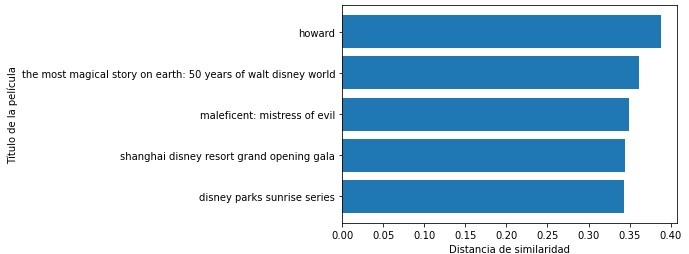

# MovieAPI

Este proyecto pretende tomar dataset acerca de peliculas y sus plataformas, y mediante estos datos crear 7 funciones con las cuales poder solicitarle a una API desplegada en Render la informacion necesaria, esto lo lograremos con las siguientes funciones:

- get_max_duration():
Esta funcion recive un año(int), una plataforma(str) y un tipo de duracion(str) y devuelve el titulo(str) de la pelicula con mayor duracion de ese año y plataforma.

- get_score_count():
Funcion que recive plataforma(str), score(int) y año(int) y devuelve la cantidad(int) de peliculas, el año(int), la plataforma(str) y el score(int) objetivo.

- get_count_platform():
La funcion recive una plataforma(str) y devuelve la cantidad(int) de producciones que hay en dicha plataforma.

- get_actor():
Esta funcion recive una plataforma(str) y un año(int) devolviendo el actor(str) que en mas producciones aparecio en ese año y plataforma.

- prod_per_county():
Funcion que toma un show_type(str), pais(str) y año(int) para entregar pais(str), año(int) y cantidad(int) de producciones que hay en ese año y pais, en caso de que una produccion tenga como pais a mas de un pais, esta funcion contara esa produccion para cada uno de esos paises.

- get_contents():
Es una funcion que recibe un rating(str) y devuelve la cantidad(int) de producciones que son calificadas con dicho rating, entindase por "rating" la calificacion etaria de la pelicula.

# ETL
Estas son 6 de las funciones con las que esta API va a trabajar, para esto fue necesario hacer un trabajo previo de ETL donde se tomaron los Datasets dados, para crear un unico Dataset con el que sera mas facil trabajar.
Algunos de los procesos con los cuales se trabajo este ETL fueron:

- Generar campo id:
En este proceso tomamos el "movieId" de los datasets y le agregamos al principio la primer letra de la plataforma a la que pertenece, "Disney", "Amazon", "Hulu" o "Netflix".

- Reemplazar los campos nulos de la columna "rating":
La columna "rating" posee la calificacion etaria de los show, en este caso llenaremos los campos vacion con el dato "G" que refiere a general para todo el publico.

- Modificar el formato de las fechas:
Tomamos las fechas y las pasamos a formato AAAA-mm-dd.

- Minusculas:
Los textos deben estar enteramente en minusculas, sin ninguna excepcion.

- Duration_int y Duration_type:
El campo "duration" se divide en duration_int y duration_type, que contienen respectivamente la duracion y la unidad de la misma, siendo duration_int un entero y duration_type "min" o "season".

# EDA
En el analisis exploratorio de datos podemos buscar patrones en los datos, correlaciones y tendencias.
- Por ejemplo, el siguiente grafico nos muestra cuales son las tendencias de las calificaciones de los usuarios:

- De este analisis tambien podemos encontrar las 10 peliculas mas vistas, y cuantos usuarios las han visto:

- Aqui estan la la primer pelicula agregada en las plataformas, y las ultimas en agregarse:

- Tambien podemos ver como la cantidad de producciones aumenta a travez de los años

# Modelo de recomendacion

Una vez tenemos todo preparado, podemos trabajar un modelo de recomendacion, en este caso usaremos un cosine_similarity y vectorizaremos las descripciones de las peliculas para si encontrar las mas similares entre si, asi tendremos la 7ma funcion, la cula tomara el titulo de una pelicula, y devolvera el titulos de las 5 peliculas mas similares.

Para este trabajo, se propone trabajar con la vectorizacion de la descripccion de la pelicula, que junto a la "pairwise_distances" o distancia euclidiana, podemos descubrir cuales son las descripciones que mas relacion contienen, a su vez, debido al tamaño de la muestra, utilizaremos "randomized_svd" para formar una muestra mas manejable de manera aleatoria.

- Aqui podemos ver un ejemplo de como se mide la similitud entre peliculas, en este caso particular estamos buscando las peliculas que te sean similares a "cruella":

